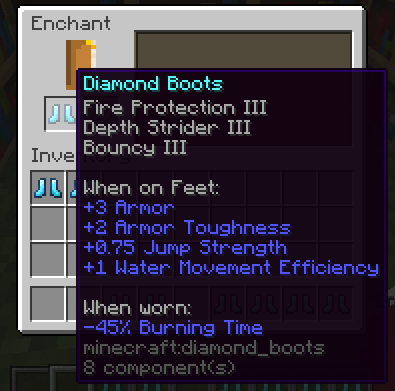
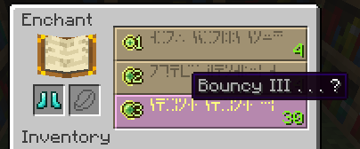

# HOW TO ADD A CUSTOM ENCHANT ON MINECRAFT 1.21

This is a very basic tutorial that will not go into how to script or valid options for enchants. For information about
those please check out these sites:

- [Minecraft Wiki - Attributes](https://minecraft.wiki/w/Attribute)
- [Minecraft Wiki - Damage Types](https://minecraft.wiki/w/Damage)
- [Minecraft Wiki - Enchants Summary](https://minecraft.wiki/w/Enchanting#Summary_of_enchantments)
- [Misode's Enchantment Generator](https://misode.github.io/enchantment/)
- [Minecraft 1.21 Changelog](https://www.minecraft.net/en-us/article/minecraft-java-edition-1-21#Enchantments)
## Layout

As of 1.21, the directories that will be relevant to making an enchantment are as follows:

```
📁 data
∙∙∙∙∙📁 minecraft
∙∙∙∙∙∙∙∙∙∙∙📁 enchantment_provider
∙∙∙∙∙∙∙∙∙∙∙∙∙∙∙∙📁 raid
∙∙∙∙∙∙∙∙∙∙∙∙∙∙∙∙📄 various enchant providers
∙∙∙∙∙∙∙∙∙∙∙📁 tags
∙∙∙∙∙∙∙∙∙∙∙∙∙∙∙∙📁 enchantment
∙∙∙∙∙∙∙∙∙∙∙∙∙∙∙∙∙∙∙∙∙📁 exclusive_set
∙∙∙∙∙∙∙∙∙∙∙∙∙∙∙∙∙∙∙∙∙📄 various enchant tags
∙∙∙∙∙📁 unique_namespace
∙∙∙∙∙∙∙∙∙∙∙📁 enchantment
∙∙∙∙∙∙∙∙∙∙∙∙∙∙∙∙📄 new enchant
```

## How to add a new enchant

### Create the enchantment
**Available Fields**

| Field             | Description                                                                                               | Data Type                               | Notes                                                                                        |
|-------------------|-----------------------------------------------------------------------------------------------------------|-----------------------------------------|----------------------------------------------------------------------------------------------|
| `description`     | The name of the Enchantment when displayed in text, represented as a Text Component                       | Text Component                          |                                                                                              |
| `exclusive_set`   | The Enchantment(s) this Enchantment is mutually exclusive with                                            | Enchantment ID / List / Enchantment Tag | If omitted, the exclusive set is empty                                                       |
| `supported_items` | The item types that can have this Enchantment                                                             | Item ID / List / Tag                    |                                                                                              |
| `primary_items`   | The item types for which this Enchantment shows up in Enchanting Tables and on traded equipment           | Item ID / List / Tag                    | Must be a subset of supported_items                                                          |
| `weight`          | How commonly the Enchantment appears, compared to the total combined weight of all available Enchantments | Positive integer (max 1024)             | Higher values mean more common                                                               |
| `max_level`       | The maximum level of the Enchantment                                                                      | Positive integer (max 255)              | All Enchantments range from level 1 to their maximum level                                   |
| `min_cost`        | Minimum cost for this Enchantment in the Enchanting Table                                                 | Linear formula                          | base + per_level_above_first * (level - 1)                                                   |
| `max_cost`        | Maximum cost for this Enchantment in the Enchanting Table                                                 | Linear formula                          | base + per_level_above_first * (level - 1)                                                   |
| `anvil_cost`      | The fee taken for the Enchantment in the anvil                                                            | Non-negative integer                    | Halved when added to a Book. The effective fee is multiplied by the level of the Enchantment |
| `slots`           | A list of slot groups this Enchantment works in                                                           | List of slot groups                     | Each entry is one of: any, hand, mainhand, offhand, armor, feet, legs, chest, head, body     |
| `effects`         | A map of effect components                                                                                | Map of effect components                | See the Effect Components section for details                                                |

For this example, I will be making a 'bouncy' enchant that makes the player have a stronger jump strength.

Because this is an enchant we are adding, it will go into our own namespace (`unique_namespace` in this example)
The directory this will go into should be set up like this:
```
📁 data
∙∙∙∙∙📁 unique_namespace
∙∙∙∙∙∙∙∙∙∙∙📁 enchantment
∙∙∙∙∙∙∙∙∙∙∙∙∙∙∙∙📄 bouncy.json
```

```json
{
  "description": "Bouncy",
  "supported_items": "#minecraft:enchantable/foot_armor",
  "weight": 2,
  "max_level": 3,
  "min_cost": {
    "base": 10,
    "per_level_above_first": 10
  },
  "max_cost": {
    "base": 30,
    "per_level_above_first": 15
  },
  "anvil_cost": 4,
  "slots": [
    "feet"
  ],
  "effects": {
    "minecraft:attributes": [
      {
        "id": "unique_namespace:enchantment.bouncy",
        "attribute": "minecraft:generic.jump_strength",
        "amount": {
          "type": "minecraft:linear",
          "base": 0.25,
          "per_level_above_first": 0.25
        },
        "operation": "add_value"
      }
    ]
  }
}
```


### Add the enchantment to the applicable tags

Note: A lot of tags in minecraft use other tags as reference. For instance the tag `non_treasure` is used in many places. If you add it to something like `non_treasure`, you do not need to add the enchant again if this tag is referenced.

For this one, we're gonna add it to `non_treasure.json` and then to `tooltip_order.json`
These tags will remain in the minecraft namespace, as we are altering tags rather than creating new ones
The layout for where these will go should be laid out like this:

```
📁 data
∙∙∙∙∙📁 minecraft
∙∙∙∙∙∙∙∙∙∙∙📁 tags
∙∙∙∙∙∙∙∙∙∙∙∙∙∙∙∙📁 enchantment
∙∙∙∙∙∙∙∙∙∙∙∙∙∙∙∙∙∙∙∙∙📄 non_treasure.json
∙∙∙∙∙∙∙∙∙∙∙∙∙∙∙∙∙∙∙∙∙📄 tooltip_order.json
```

The two files are as follows:

`non_treasure.json`:
```json
{
  "replace": false,
  "values": [
    "unique_namespace:bouncy"
  ]
}
```

`tooltip_order.json`
```json
{
  "replace": false,
  "values": [
    "unique_namespace:bouncy"
  ]
}
```

For tooltip order, if you want to move your item higher, you will need to change the `replace` option to be true, copy the original options and then put your item in wherever you want it to go.

### Test your enchant in-game

<br>

<br>
